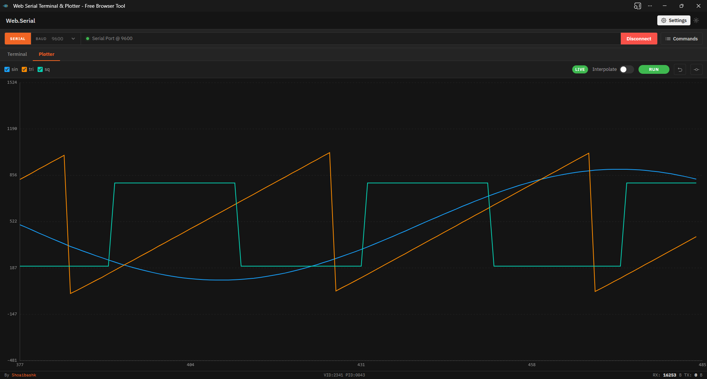

<h1 align="center">Web.Serial</h1>
<p align="center">
	<a href="https://github.com/Shoaibashk/web.serial/blob/main/LICENSE"></a>
	<a href="https://github.com/Shoaibashk/web.serial"></a>
	<a href="https://github.com/Shoaibashk/web.serial"></a>
</p>

<p align="center">
	<!-- Add your screenshot image.png here -->
	
</p>

A modern, serverless browser terminal for serial communication using the Web Serial API. This lightweight project requires no build step and is production-ready for deployment as static files (HTTPS or localhost required for the Web Serial API).

## Quick Start

1. Serve the project from `localhost` or HTTPS. Web Serial will not work from plain `file://` URLs.
2. Open the app in Chrome, Edge, or Opera on desktop.
3. Connect a device, match the serial settings, and start sending data.

```bash
python -m http.server 3000
```

Open `http://localhost:3000` after starting the server.

## What It Includes

- Modern and traditional terminal modes.
- Saved commands and configurable serial settings.
- Plotter support for visualizing incoming data.
- Light and dark themes.
- PWA/offline support after the first load.

## Documentation

- [Installation](docs/installation.md)
- [Usage](docs/usage.md)
- [Features](docs/features.md)
- [Architecture](docs/architecture.md)
- [Contributing](docs/contributing.md)
- [Troubleshooting](docs/troubleshooting.md)

## Contributing

Contributions are welcome — please see the [Contributing](docs/contributing.md) guide for workflow and style rules. When applicable, follow the project's code-generation workflow (vibecoding) and include a clear description of changes, testing steps, and any manual verification required.

## Support

- Repository: [github.com/Shoaibashk/web.serial](https://github.com/Shoaibashk/web.serial)
- Author: [github.com/shoaibashk](https://github.com/shoaibashk)

## License

This project is licensed under the Apache License 2.0. See [LICENSE](LICENSE) for the full terms.
